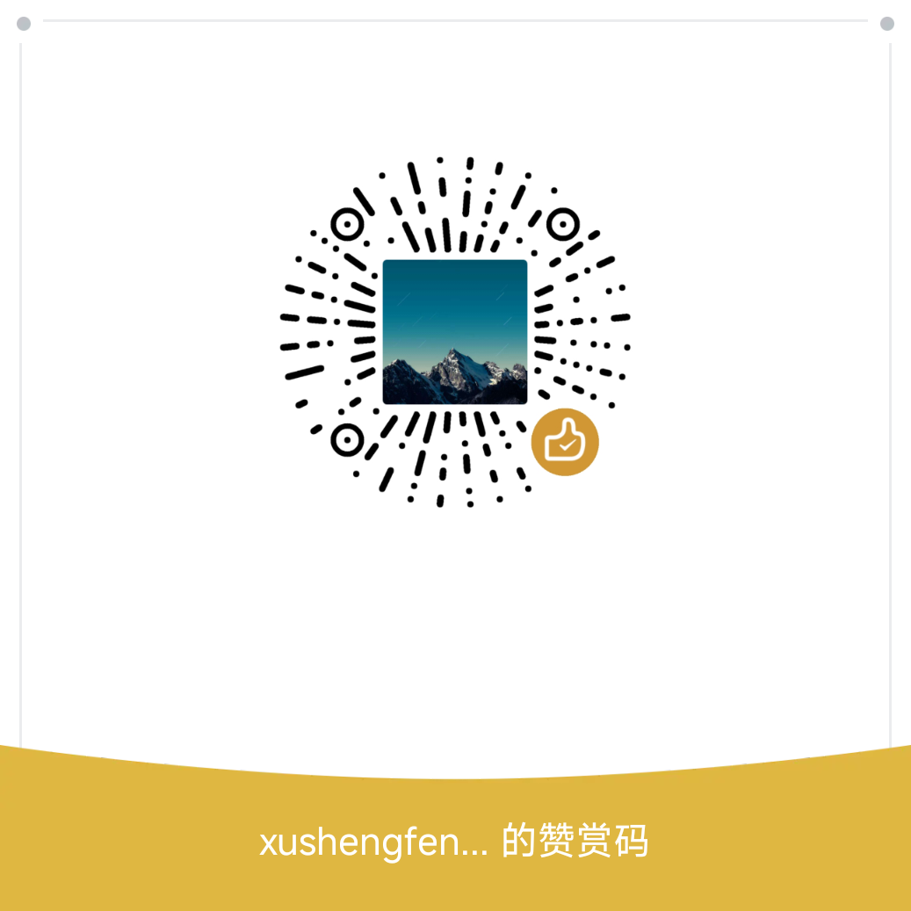

# 
xushengfeng

[eSearch](https://github.com/xushengfeng/eSearch) 跨平台 截屏 离线 OCR 搜索翻译 以图搜图 贴图 录屏 滚动截屏

[xlinkote](https://github.com/xushengfeng/xlinkote) 类似 onenote 的在线笔记软件 无限画布 白板笔记 知识管理

[rmbw2](https://github.com/xushengfeng/rmbw2) 语境下学习单词，单词拼写

[shudu](https://github.com/xushengfeng/shudu) 数独，自动分支存档，方便探索试数，有简单策略提示

[lime](https://github.com/xushengfeng/lime) 由大模型优化的拼音输入法

系统应用

[myde](https://github.com/xushengfeng/myde) 用 Electron 开发的 Linux Wayland 桌面，可以用前端技术自定义界面交互

[aurora](https://github.com/xushengfeng/aurora) aur 安装帮手，支持 GitHub 镜像，方便大陆网络环境使用

观赏性的作品

[x-lang](https://github.com/xushengfeng/x-lang) 低代码编辑器，可以渲染为魔法阵

[eSearch-website](https://github.com/xushengfeng/eSearch-website) eSearch 的网站，无限滚动

一些方便的库

[eSearch-OCR](https://github.com/xushengfeng/eSearch-OCR) 基于 paddleOCR 的 nodejs 库

[xtranslator](https://github.com/xushengfeng/xtranslator) 各平台翻译 api 聚合

还有一堆项目建设中……

觉得我的项目不错？可以赞赏：

